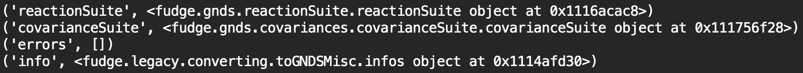

ENDF6 conversion to GNDS
========================
GNDS is described as a replacement for the ENDF6 nuclear data format (Brown et al., 2019) and one
of the most obvious applications for a processing code such as FUDGE is the ability to convert
nuclear data libraries from ENDF6 to GNDS. The code snippet below shows how this goal may be 
achieved in FUDGE.

The method ``fudge.legacy.converting.endfFileToGNDS.endfFileToGNDS()`` is used to convert the ENDF6 
nuclear data for the reaction :math:`\left(n,\,^1H\right)` to GNDS and returns a dictionary 
(``endfToGndsOutput``) with the contents shown below.

The reactionSuite and covarianceSuite instances are made available as separate dictionary value objects
and lines 7 and 8 demonstrate their saving to external files.

.. code-block:: python
   :linenos:

   from fudge.legacy.converting import endfFileToGNDS as endfFileToGNDSModule

   # convert ENDF6 to GNDS
   endfToGndsOutput = endfFileToGNDSModule.endfFileToGNDS('n-001_H_001.endf')

   # save the reactionSuite and covarianceSuite
   endfToGndsOutput['reactionSuite'].saveToFile('n-001_H_001.reactionSuite.gnds.xml');
   endfToGndsOutput['covarianceSuite'].saveToFile('n-001_H_001.covariance.gnds.xml')

