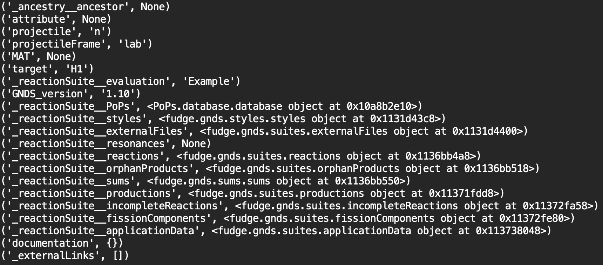
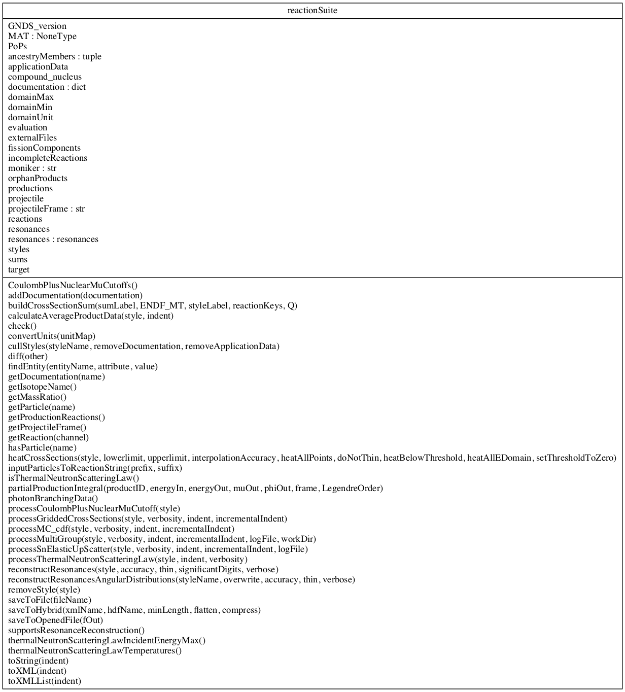

reactionSuite
=============

GNDS uses the reactionSuite container to group the evaluation of a reaction (i.e. the combination of a 
projectile and a target). This container consists of several attributes and child nodes, and the FUDGE
support for these is described below.

The first section shows a collapsed view of the reactionSuite node in a GNDS XML output file. This is 
followed by a description of the FUDGE support for each of these GNDS attributes and child nodes.

GNDS representation of the reactionSuite
----------------------------------------
The image below shows a high level (collapsed) view of the GNDS representation of the reactionSuite 
for the :math:`\left(n,\,^1H\right)` reaction suite. This GNDS content was generated from the conversion
of the ENDF6 nuclear data as shown in :ref:`ENDF6 conversion to GNDS` .

.. image:: ../images/gndsReactionSuiteLevel1.png

FUDGE representation of the reactionSuite
-----------------------------------------

.. code-block:: python

   from fudge import reactionSuite as reactionSuiteModule

   # instantiate reactionSuite
   reactionSuite = reactionSuiteModule.reactionSuite(projectile='n', target='H1', evaluation='Example')

   # print instance variables
   for instanceVariable in vars(reactionSuite).items():
       print(instanceVariable)

The class ``fudge.reactionSuite.reactionSuite`` is the blueprint for the reactionSuite in FUDGE and
its instantiation with the minimum amount of required input arguments is demonstrated above. This is followed
by python code to print the resulting instance variables which is shownin the image below.

Summary
-------

.. +-----------------+----------------+-------------------------------------------+
.. |  externalFiles  |   child node   |  fudge.suites.externalFiles object   | new fudge.suites.externalFiles object | new fudge.suites.externalFiles object
.. +-----------------+----------------+-------------------------------------------+ 
.. |  documentations |   child node   |           dictionary object            |
.. +-----------------+----------------+----------------------------------------+
.. |       PoPs      |   child node   |      PoPs.database.database object     |
.. +-----------------+----------------+----------------------------------------+
.. |    resonances   |   child node   |           dictionary object            |
.. +-----------------+----------------+----------------------------------------+
.. |     reactions   |   child node   |   fudge.suites.reactions object   |
.. +-----------------+----------------+----------------------------------------+
.. |       sums      |   child node   |       fudge.sums.sums object      |
.. +-----------------+----------------+----------------------------------------+
.. | applicationData |   child node   |    fudge.suites.applicationData   |
.. +-----------------+----------------+----------------------------------------+

Ancestry and class diagrams
---------------------------

The inheretence diagram for the class reactionSuite is shown below.

.. inheritance-diagram:: fudge.reactionSuite.reactionSuite

The corresponding UML diagram is as follows:

Python source documenation
--------------------------

.. automodule:: fudge.reactionSuite
    :members: reactionSuite
    :undoc-members:
    :show-inheritance:
